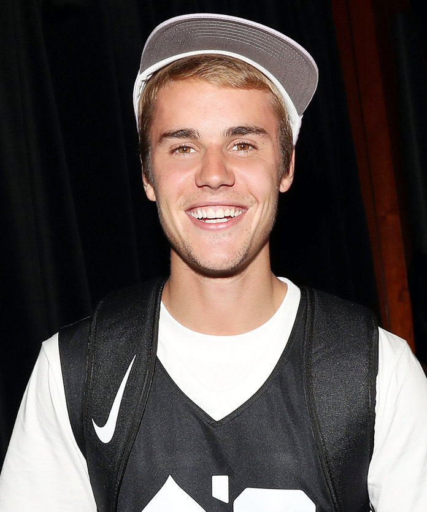
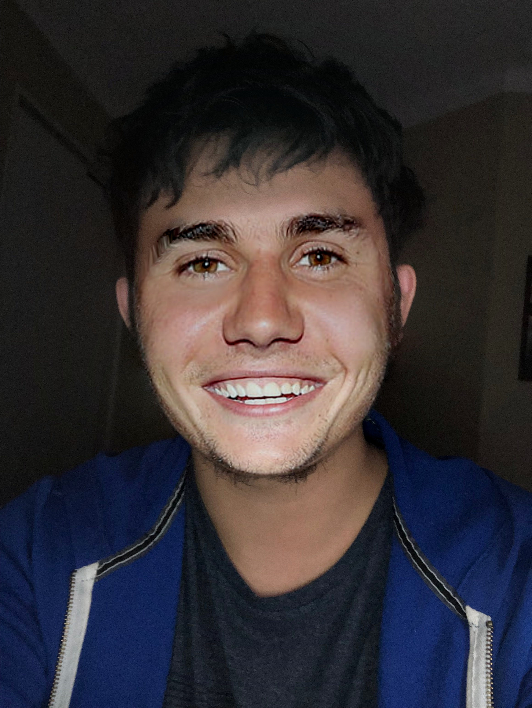

# Face Swap 

this project is to map celebrity's face to a different person using dlib and opencv.<br><br>




# After Facial Mapping:



# Requirement:
* python3-opencv
* dlib
* numpy  
# Usage:
## Extract Facial Landmarks
```bash
python3 facial_point.py --input1='path to your image'\ 
                         --input2='path to celebrity picture' 
```

## Mapping Face
```bash
python3 faceSwap.py --input1='path to your image'\ 
                         --input2='path to celebrity picture' 
```